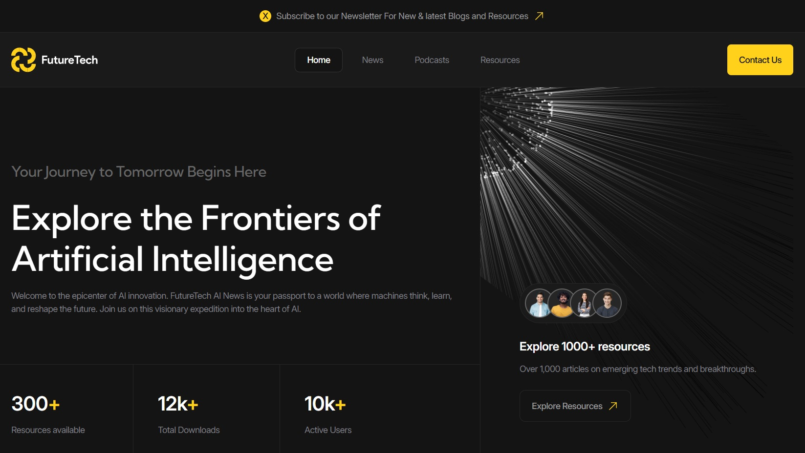

# Future Tech website

## Welcome! 👋

This project was implemented according to the model [Future Tech](https://www.figma.com/design/YzTDRV7OaSoeCUBNYaoCZV)

Challenge is to build out this multi-page Future Tech website and get it looking as close to the design as possible.

The layout was created using native JS, SCSS, BEM, IMask lib, WebPack.

## Getting Started ✔

Run the development server:
1. npm run build
2. npm start
3. Open [http://localhost:3000](http://localhost:3000) with your browser to see the result.